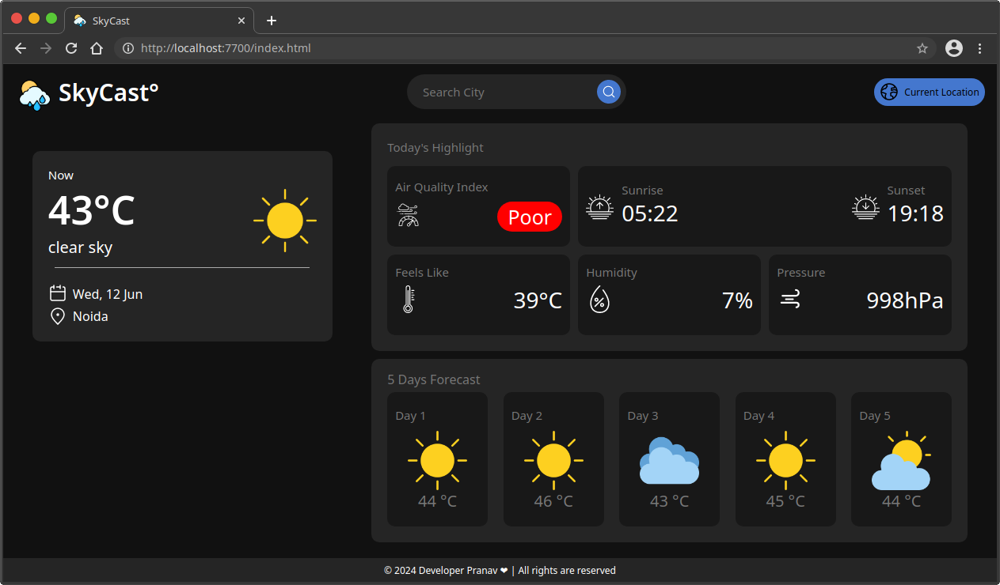

# SkyCast°


SkyCast° is a user-friendly weather website that provides real-time weather information for any location in the world. It allows users to check current weather conditions, air quality index (AQI), sunrise and sunset times, 5-day weather forecasts, and more.

## Features

- **Current Location Weather**: Get real-time weather updates for your current location.
- **Air Quality Index (AQI)**: View the current air quality index for your location.
- **Sunrise and Sunset Times**: Check the sunrise and sunset times for your location.
- **5-Day Forecast**: View the weather forecast for the next five days.
- **Search**: Easily search for weather information by city name or coordinates.
- **User-friendly Interface**: Simple and intuitive UI for a seamless experience.

## Screenshot




## Installation

### Prerequisites

- A modern web browser (Chrome, Firefox, Safari, etc.)
- A weather API key (e.g., from [OpenWeatherMap](https://openweathermap.org/))

### Steps

1. Clone the repository:
    ```bash
    git clone https://github.com/developer-pranav/Skycast.git
    cd Skycast
    ```

2. Open the `index.html` file in your web browser.

3. Create a `script.js` file in the root directory and add your API key:
    ```javascript
    const apiKey = 'your_api_key_here';
    ```

## Usage

1. Open the `index.html` file in your web browser.
2. Allow the website to access your location for real-time weather updates.
3. Use the search bar to find weather information for specific cities.
4. View the current weather conditions, AQI, sunrise and sunset times, and 5-day forecast.

## Dependencies

- HTML
- CSS
- JavaScript
- Weather API (OpenWeatherMap)

## Configuration

Make sure to set your weather API key in the `script.js` file as mentioned in the installation steps.

## License

This project is licensed under the MIT License - see the [LICENSE](LICENSE.txt) file for details.

## Contributing

1. Fork the repository.
2. Create a new branch (`git checkout -b feature/YourFeature`).
3. Commit your changes (`git commit -am 'Add some feature'`).
4. Push to the branch (`git push origin feature/YourFeature`).
5. Create a new Pull Request.

## Contact

For any questions or suggestions, please open an issue or contact [yourname](mailto:developer.pranav3306@gmail.com.com).
